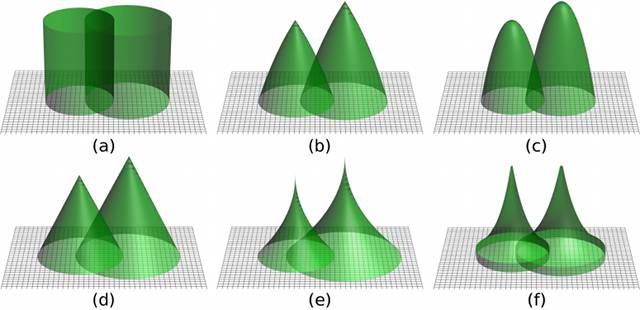

# siplab  -  Spatial Individual-Plant Simulation

An R platform for computing competition indices and experimenting with spatially explicit individual-based vegetation models.

* **Master** branch: Current _siplab_ version 1.4 in CRAN,  <https://cran.r-project.org/package=siplab>
* **Development** branch: Work in progress for next version.

References:
* García, O. (2014). "Siplab, a spatial individual-based plant modelling system". *Computational Ecology and Software 4*(4): 215-222. <https://www.researchgate.net/publication/267695426>
* García, O. (2014). "A generic approach to spatial individual-based modelling and simulation of plant communities". *Mathematical and Computational Forestry and Nat.-Res. Sci. (MCFNS) 6*(1), 36-47. <http://mcfns.net/index.php/Journal/article/view/6_36>
* García, O. (2014). "Can plasticity make spatial structure irrelevant in individual-tree models?" *Forest Ecosystems* 1, 16. <https://dx.doi.org/10.1186/s40663-014-0016-1>
* Lee, M. J. and García, O. (2016). "Plasticity and Extrapolation in Modeling Mixed-Species Stands". *Forest Science 62*(1): 1-8. <https://www.researchgate.net/publication/280939838>
